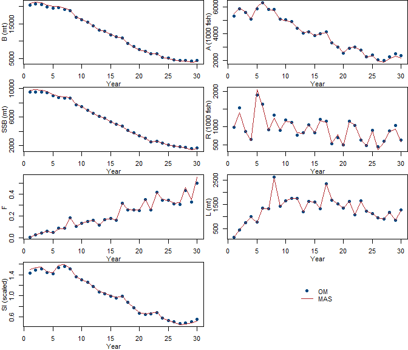
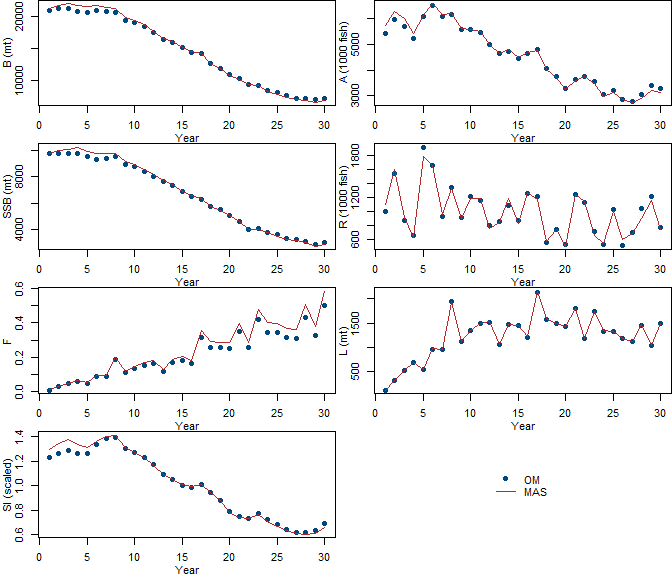
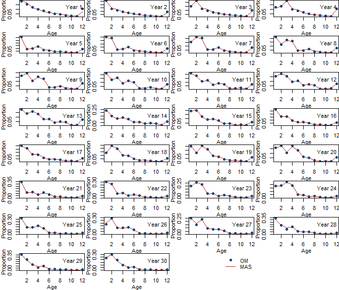
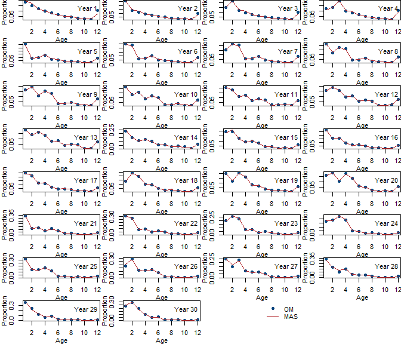
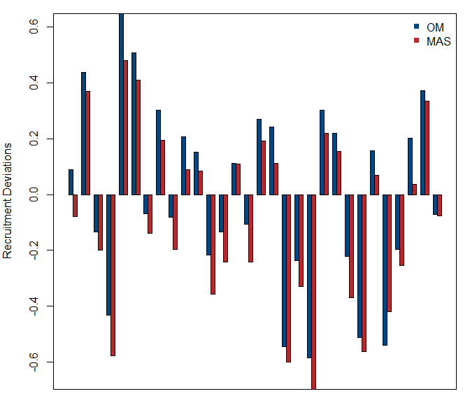
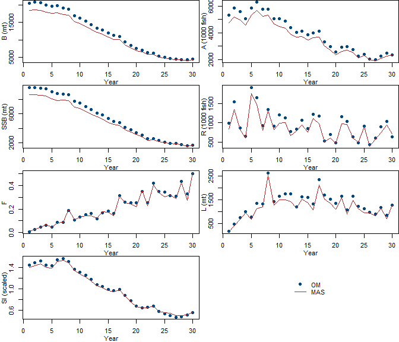
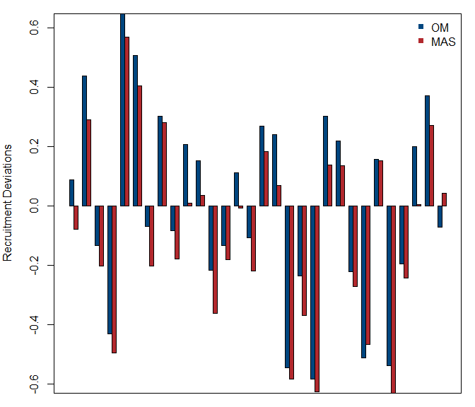
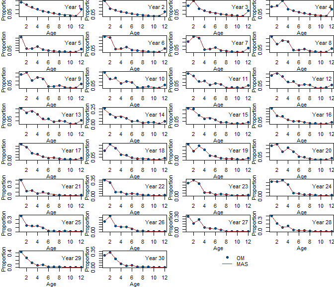

    # Check snapper grouper cases 1 (null case), 8 (double logistic selectivity), and 12 (misreported catch)
    library(ASSAMC)
    project_dir <- "C:/Users/bai.li/Documents/Github/r4MAS-model-comparison"

    scenarios <- expand.grid(estimate_selectivity_options = c(TRUE, FALSE), 
                             cases = c("c1", "c8", "c12"))

    for (scenario_id in 1:nrow(scenarios)){
      # load simulated data from the operating model ----------------------------
      
      case_id <- as.character(scenarios$cases[scenario_id])
      estimate_selectivity_params <- scenarios$estimate_selectivity_options[scenario_id]
      
      switch(
        case_id,
        
        "c1" = load(file.path(project_dir, "investigation", "OM1.RData")),
        "c8" = load(file.path(project_dir, "investigation", "OM8.RData")),
        "c12" = load(file.path(project_dir, "investigation", "OM12.RData")),
        
      )
      
      
      # run MAS -----------------------------------------------------------------
      
      library(r4MAS)
      r4mas <- Rcpp::Module("rmas", PACKAGE = "r4MAS")
      
      nyears <- om_input$nyr
      nseasons <- 1
      nages <- om_input$nages
      ages <- om_input$ages
      area1 <- new(r4mas$Area)
      area1$name <- "area1"
      
      recruitment <- new(r4mas$BevertonHoltRecruitment)
      recruitment$R0$value <- om_input$R0 / 1000
      recruitment$R0$estimated <- TRUE
      recruitment$R0$phase <- 1
      recruitment$h$value <- om_input$h
      recruitment$h$estimated <- FALSE
      recruitment$h$phase <- 3
      recruitment$h$min <- 0.2001
      recruitment$h$max <- 1.0
      recruitment$sigma_r$value <- om_input$logR_sd
      recruitment$sigma_r$estimated <- FALSE
      recruitment$sigma_r$min <- 0
      recruitment$sigma_r$max <- 1.0
      recruitment$sigma_r$phase <- 2
      recruitment$estimate_deviations <- TRUE
      recruitment$constrained_deviations <- TRUE
      recruitment$deviations_min <- -15.0
      recruitment$deviations_max <- 15.0
      recruitment$deviation_phase <- 2
      recruitment$SetDeviations(rep(0.0, times = nyears))
      recruitment$use_bias_correction <- FALSE
      
      growth <- new(r4mas$VonBertalanffyModified)
      empirical_weight <- rep(om_input$W.kg, times = om_input$nyr)
      survey_empirical_weight <- replicate(nages * nyears, 1.0)
      growth$SetUndifferentiatedCatchWeight(empirical_weight)
      growth$SetUndifferentiatedWeightAtSeasonStart(empirical_weight)
      growth$SetUndifferentiatedWeightAtSpawning(empirical_weight)
      growth$SetUndifferentiatedSurveyWeight(survey_empirical_weight)
      
      maturity <- new(r4mas$Maturity)
      maturity$values <- om_input$mat.age 
      
      natural_mortality <- new(r4mas$NaturalMortality)
      natural_mortality$SetValues(om_input$M.age)
      
      # Only 1 area in this model
      movement <- new(r4mas$Movement)
      movement$connectivity_females <- c(0.0)
      movement$connectivity_males <- c(0.0)
      movement$connectivity_recruits <- c(0.0)
      
      initial_deviations <- new(r4mas$InitialDeviations)
      initial_deviations$values <- rep(0.0, times = om_input$nages)
      initial_deviations$estimate <- TRUE
      initial_deviations$phase <- 2
      
      population <- new(r4mas$Population)
      for (y in 1:(nyears))
      {
        population$AddMovement(movement$id, y)
      }
      population$AddNaturalMortality(natural_mortality$id, area1$id, "undifferentiated")
      population$AddMaturity(maturity$id, area1$id, "undifferentiated")
      population$AddRecruitment(recruitment$id, 1, area1$id)
      population$SetInitialDeviations(initial_deviations$id, area1$id, "undifferentiated")
      population$SetGrowth(growth$id)
      population$sex_ratio <- 0.5
      
      if (case_id == "c12"){
        # Catch index values and observation errors
        L.age.miscatch <- om_output$L.age
        L.mt.miscatch <- om_output$L.mt
        
        mismatch_ratio <- runif(n = om_input$nyr, min = 0.8, max = 1.0)

        for (i in 1:om_input$fleet_num) {
          for (j in 1:om_input$nyr) {
            L.age.miscatch[[i]][j, ] <- om_output$L.age[[i]][j, ] * mismatch_ratio[j]
            L.mt.miscatch[[i]][j] <- sum(L.age.miscatch[[i]][j, ] * om_input$W.mt)
          }
        }

        em_input <- ASSAMC::ObsModel(
          nyr = om_input$nyr,
          nages = om_input$nages,
          fleet_num = om_input$fleet_num,
          L = L.mt.miscatch,
          survey_num = om_input$survey_num,
          survey = om_output$survey_index,
          L.age = L.age.miscatch,
          survey.age = om_output$survey_age_comp,
          cv.L = om_input$cv.L,
          cv.survey = om_input$cv.survey,
          n.L = om_input$n.L,
          n.survey = om_input$n.survey
        )

        em_input$cv.L <- om_input$cv.L
        em_input$cv.survey <- om_input$cv.survey

      }
      
      # Catch index values and observation errors
      catch_index <- new(r4mas$IndexData)
      catch_index$values <- em_input$L.obs$fleet1
      catch_index$error <- rep(em_input$cv.L$fleet1, times = om_input$nyr)
      # Catch composition data
      catch_comp <- new(r4mas$AgeCompData)
      catch_comp$values <- as.vector(t(em_input$L.age.obs$fleet1))
      catch_comp$sample_size <- rep(em_input$n.L$fleet1, nyears * nseasons)
      # Likelihood component settings
      fleet_index_comp_nll <- new(r4mas$Lognormal)
      fleet_index_comp_nll$use_bias_correction <- FALSE
      fleet_age_comp_nll <- new(r4mas$Multinomial)
      # Fleet selectivity settings
      if (om_input$sel_fleet$fleet1$pattern == 1) {
        fleet_selectivity <- new(r4mas$LogisticSelectivity)
        fleet_selectivity$a50$value <- om_input$sel_fleet$fleet1$A50.sel
        fleet_selectivity$a50$estimated <- estimate_selectivity_params
        fleet_selectivity$a50$phase <- 2
        fleet_selectivity$a50$min <- 0.0
        fleet_selectivity$a50$max <- max(om_input$ages)
        fleet_selectivity$slope$value <- 1 / om_input$sel_fleet$fleet1$slope.sel
        fleet_selectivity$slope$estimated <- estimate_selectivity_params
        fleet_selectivity$slope$phase <- 2
        fleet_selectivity$slope$min <- 0.0001
        fleet_selectivity$slope$max <- 5
      }
      
      if (om_input$sel_fleet$fleet1$pattern == 2) {
        fleet_selectivity <- new(r4mas$DoubleLogisticSelectivity)
        
        fleet_selectivity$alpha_asc$value <- om_input$sel_fleet$fleet1$A50.sel1
        fleet_selectivity$alpha_asc$estimated <- estimate_selectivity_params
        fleet_selectivity$alpha_asc$phase <- 2
        fleet_selectivity$alpha_asc$min <- 0.0
        fleet_selectivity$alpha_asc$max <- max(om_input$ages)
        
        fleet_selectivity$beta_asc$value <- om_input$sel_fleet$fleet1$slope.sel1
        fleet_selectivity$beta_asc$estimated <- estimate_selectivity_params
        fleet_selectivity$beta_asc$phase <- 2
        fleet_selectivity$beta_asc$min <- 0.0001
        fleet_selectivity$beta_asc$max <- max(om_input$ages)
        
        fleet_selectivity$alpha_desc$value <- om_input$sel_fleet$fleet1$A50.sel2
        fleet_selectivity$alpha_desc$estimated <- estimate_selectivity_params
        fleet_selectivity$alpha_desc$phase <- 2
        fleet_selectivity$alpha_desc$min <- 0.0
        fleet_selectivity$alpha_desc$max <- max(om_input$ages)
        
        fleet_selectivity$beta_desc$value <- om_input$sel_fleet$fleet1$slope.sel2
        fleet_selectivity$beta_desc$estimated <- estimate_selectivity_params
        fleet_selectivity$beta_desc$phase <- 2
        fleet_selectivity$beta_desc$min <- 0.0001
        fleet_selectivity$beta_desc$max <- max(om_input$ages)
        
      }
      
      
      # Fishing mortality settings
      fishing_mortality <- new(r4mas$FishingMortality)
      fishing_mortality$estimate <- TRUE
      fishing_mortality$phase <- 1
      fishing_mortality$min <- 0.0
      fishing_mortality$max <- 4
      fishing_mortality$SetValues(om_output$f)
      # Create the fleet
      fleet <- new(r4mas$Fleet)
      fleet$AddIndexData(catch_index$id, "undifferentiated")
      fleet$AddAgeCompData(catch_comp$id, "undifferentiated")
      fleet$SetIndexNllComponent(fleet_index_comp_nll$id)
      fleet$SetAgeCompNllComponent(fleet_age_comp_nll$id)
      fleet$AddSelectivity(fleet_selectivity$id, 1, area1$id)
      fleet$AddFishingMortality(fishing_mortality$id, 1, area1$id)
      
      # Survey index values and observation errors
      survey_index <- vector(mode = "list", length = om_input$survey_num)
      
      for (i in 1:om_input$survey_num) {
        survey_index[[i]] <- new(r4mas$IndexData)
        # survey_index[[i]]$id <- i
        survey_index[[i]]$values <- em_input$survey.obs[[i]]
        survey_index[[i]]$error <- rep(em_input$cv.survey[[i]], times = om_input$nyr)
      }
      
      # Survey composition
      survey_comp <- vector(mode = "list", length = om_input$survey_num)
      for (i in 1:om_input$survey_num) {
        survey_comp[[i]] <- new(r4mas$AgeCompData)
        # survey_comp[[i]]$id <- i
        survey_comp[[i]]$values <- as.vector(t(em_input$survey.age.obs[[i]]))
        survey_comp[[i]]$sample_size <- rep(em_input$n.survey[[i]], times = om_input$nyr)
      }
      
      # Likelihood component settings
      
      survey_index_comp_nll <- vector(mode = "list", length = om_input$survey_num)
      survey_age_comp_nll <- vector(mode = "list", length = om_input$survey_num)
      for (i in 1:om_input$survey_num) {
        survey_index_comp_nll[[i]] <- new(r4mas$Lognormal)
        survey_index_comp_nll[[i]]$use_bias_correction <- FALSE
        # survey_index_comp_nll[[i]]$id <- i
        
        survey_age_comp_nll[[i]] <- new(r4mas$Multinomial)
        # survey_age_comp_nll[[i]]$id <- i
      }
      
      # Survey selectivity settings
      survey_selectivity <- vector(mode = "list", length = om_input$survey_num)
      
      for (i in 1:om_input$survey_num) {
        selectivity_option <- om_input$sel_survey[[i]]$pattern
        
        if (selectivity_option == 1) {
          survey_selectivity[[i]] <- new(r4mas$LogisticSelectivity)
          # survey_selectivity[[i]]$id <- i
          survey_selectivity[[i]]$a50$value <- om_input$sel_survey[[i]]$A50.sel
          survey_selectivity[[i]]$a50$estimated <- estimate_selectivity_params
          survey_selectivity[[i]]$a50$phase <- 2
          survey_selectivity[[i]]$a50$min <- 0
          survey_selectivity[[i]]$a50$max <- max(om_input$ages)
          
          survey_selectivity[[i]]$slope$value <- 1 / om_input$sel_survey[[i]]$slope.sel
          survey_selectivity[[i]]$slope$estimated <- estimate_selectivity_params
          survey_selectivity[[i]]$slope$phase <- 2
          survey_selectivity[[i]]$slope$min <- 0.0001
          survey_selectivity[[i]]$slope$max <- max(om_input$ages)
        }
        
        if (selectivity_option == 2) {
          survey_selectivity[[i]] <- new(r4mas$DoubleLogisticSelectivity)
          # survey_selectivity[[i]]$id <- i
          
          survey_selectivity[[i]]$alpha_asc$value <- om_input$sel_survey[[i]]$A50.sel1
          survey_selectivity[[i]]$alpha_asc$estimated <- estimate_selectivity_params
          survey_selectivity[[i]]$alpha_asc$phase <- 2
          survey_selectivity[[i]]$alpha_asc$min <- 0.0
          survey_selectivity[[i]]$alpha_asc$max <- max(om_input$ages)
          
          survey_selectivity[[i]]$beta_asc$value <- om_input$sel_survey[[i]]$slope.sel1
          survey_selectivity[[i]]$beta_asc$estimated <- estimate_selectivity_params
          survey_selectivity[[i]]$beta_asc$phase <- 2
          survey_selectivity[[i]]$beta_asc$min <- 0.0001
          survey_selectivity[[i]]$beta_asc$max <- max(om_input$ages)
          
          survey_selectivity[[i]]$alpha_desc$value <- om_input$sel_survey[[i]]$A50.sel2
          survey_selectivity[[i]]$alpha_desc$estimated <- estimate_selectivity_params
          survey_selectivity[[i]]$alpha_desc$phase <- 2
          survey_selectivity[[i]]$alpha_desc$min <- 0.0
          survey_selectivity[[i]]$alpha_desc$max <- max(om_input$ages)
          
          survey_selectivity[[i]]$beta_desc$value <- om_input$sel_survey[[i]]$slope.sel2
          survey_selectivity[[i]]$beta_desc$estimated <- estimate_selectivity_params
          survey_selectivity[[i]]$beta_desc$phase <- 2
          survey_selectivity[[i]]$beta_desc$min <- 0.0001
          survey_selectivity[[i]]$beta_desc$max <- max(om_input$ages)
          
        }
        
      }
      
      # Create the survey
      survey <- vector(mode = "list", length = om_input$survey_num)
      for (i in 1:om_input$survey_num) {
        survey[[i]] <- new(r4mas$Survey)
        
        survey[[i]]$AddIndexData(survey_index[[i]]$id, "undifferentiated")
        survey[[i]]$AddAgeCompData(survey_comp[[i]]$id, "undifferentiated")
        survey[[i]]$SetIndexNllComponent(survey_index_comp_nll[[i]]$id)
        survey[[i]]$SetAgeCompNllComponent(survey_age_comp_nll[[i]]$id)
        survey[[i]]$AddSelectivity(survey_selectivity[[i]]$id, 1, area1$id)
        
        survey[[i]]$q$value <- em_input$survey_q[[i]]
        survey[[i]]$q$min <- 0
        survey[[i]]$q$max <- 10
        survey[[i]]$q$estimated <- TRUE
        survey[[i]]$q$phase <- 1
      }
      
      mas_model <- new(r4mas$MASModel)
      mas_model$compute_variance_for_derived_quantities<-FALSE
      mas_model$nyears <- nyears
      mas_model$nseasons <- nseasons
      mas_model$nages <- nages
      mas_model$extended_plus_group <- max(om_input$ages)
      mas_model$ages <- ages
      mas_model$catch_season_offset <- 0.0
      mas_model$spawning_season_offset <- 0.0
      mas_model$survey_season_offset <- 0.0
      mas_model$AddPopulation(population$id)
      mas_model$AddFleet(fleet$id)
      for (i in 1:om_input$survey_num) {
        mas_model$AddSurvey(survey[[i]]$id)
      }
      
      
      # mas_model$tolerance <- 0.0001
      
      # Run MAS
      mas_model$Run()
      output_file <- file.path(project_dir, "investigation", paste0(case_id, ".json"))
      write(mas_model$GetOutput(), file = toString(output_file))
      mas_model$Reset()
      
      
      # plot MAS results --------------------------------------------------------
      cat(paste0("\n Case ID: ", case_id, "\nEstimate selectivity parameters: ", estimate_selectivity_params, "\n"))
      
      # OM output
      om <- list()
      om$biomass <- om_output$biomass.mt
      om$abundance <- om_output$abundance / 1000
      om$ssb <- om_output$SSB
      om$recruit <- om_output$N.age[, 1] / 1000
      om$f <- apply(om_output$FAA, 1, max)
      om$landing <- om_output$L.mt$fleet1
      om$survey <- om_output$survey_index$survey1
      om$msy <- om_output$msy$msy
      om$fmsy <- round(om_output$msy$Fmsy, digits = 3)
      om$ssbmsy <- om_output$msy$SSBmsy
      om$fratio <- om$f / om$fmsy
      om$ssbratio <- om$ssb / om$ssbmsy
      om$agecomp <- apply(om_output$N.age / 1000, 1, function(x) x / sum(x))
      om$r0 <- om_input$R0 / 1000
      om$q <- om_output$survey_q
      om$selexparm_fleet <- om_input$sel_fleet
      om$selexparm_survey <- om_input$sel_survey
      om$recruit_deviation <- om_input$logR.resid
      
      # MAS output
      mas_output <- jsonlite::read_json(output_file)
      
      parameter <- unlist(mas_output$estimated_parameters$parameters)
      parameter_table <- as.data.frame(matrix(parameter, ncol = 3, byrow = TRUE))
      colnames(parameter_table) <- c(
        "Parameter",
        "Value",
        "Gradient"
      )
      parameter_table$Value <- round(as.numeric(parameter_table$Value),
                                     digits = 6
      )
      parameter_table$Gradient <- round(as.numeric(parameter_table$Gradient),
                                        digits = 6
      )
      parameter_table
      
      popdy <- mas_output$population_dynamics
      pop <- popdy$populations[[1]]
      flt <- popdy$fleets[[1]]
      srvy <- popdy$surveys[[1]]
      mas <- list()
      mas$biomass <- unlist(pop$undifferentiated$biomass$values)
      mas$abundance <- unlist(pop$undifferentiated$abundance$values)
      mas$ssb <- unlist(pop$undifferentiated$spawning_stock_biomass$values)
      mas$recruit <- unlist(pop$undifferentiated$recruits$values)
      mas$f <- unlist(pop$undifferentiated$fishing_mortality$values)
      mas$landing <- unlist(flt$undifferentiated$catch_biomass$values)
      mas$survey <- unlist(srvy$undifferentiated$survey_biomass$values)
      mas$msy <- pop$MSY$msy
      mas$fmsy <- round(pop$MSY$F_msy, digits = 3)
      mas$ssbmsy <- pop$MSY$SSB_msy
      mas$agecomp <- apply(
        matrix(unlist(pop$undifferentiated$numbers_at_age$values),
               nrow = popdy$nyears,
               ncol = popdy$nages,
               byrow = T
        ),
        1,
        function(x) x / sum(x)
      )
      mas$r0 <- exp(parameter_table$Value[parameter_table$Parameter == "log_R0_1"])
      mas$q <- list(parameter_table$Value[parameter_table$Parameter == "q_1"] / 1000)
      
      if (om_input$sel_fleet$fleet1$pattern == 1) {
        mas$selexparm_fleet <- list(
          a50 = ifelse(estimate_selectivity_params, parameter_table$Value[parameter_table$Parameter == "logistic_selectivity_a50_1"], NA),
          slope = ifelse(estimate_selectivity_params, parameter_table$Value[parameter_table$Parameter == "logistic_selectivity_slope_1"], NA)
        )
      }
      
      if (om_input$sel_fleet$fleet1$pattern == 2) {
        mas$selexparm_fleet <- list(
          a50_asc = ifelse(estimate_selectivity_params, parameter_table$Value[parameter_table$Parameter == "double_logistic_selectivity_alpha_asc_1"], NA),
          slope_asc = ifelse(estimate_selectivity_params, parameter_table$Value[parameter_table$Parameter == "double_logistic_selectivity_beta_asc_1"], NA),
          a50_desc = ifelse(estimate_selectivity_params, parameter_table$Value[parameter_table$Parameter == "double_logistic_selectivity_alpha_desc_1"], NA),
          slope_desc = ifelse(estimate_selectivity_params, parameter_table$Value[parameter_table$Parameter == "double_logistic_selectivity_beta_desc_1"], NA)
        )
      }
      
      if (om_input$sel_survey$survey1$pattern==1) {
        mas$selexparm_survey <- list(
          a50 = ifelse(estimate_selectivity_params, parameter_table$Value[parameter_table$Parameter == "logistic_selectivity_a50_2"], NA),
          slope = ifelse(estimate_selectivity_params, parameter_table$Value[parameter_table$Parameter == "logistic_selectivity_slope_2"], NA)
        )
      }
      
      if (om_input$sel_survey$survey1$pattern==2) {
        mas$selexparm_survey <- list(
          a50_asc = ifelse(estimate_selectivity_params, parameter_table$Value[parameter_table$Parameter == "double_logistic_selectivity_alpha_asc_2"], NA),
          slope_asc = ifelse(estimate_selectivity_params, parameter_table$Value[parameter_table$Parameter == "double_logistic_selectivity_beta_asc_2"], NA),
          a50_desc = ifelse(estimate_selectivity_params, parameter_table$Value[parameter_table$Parameter == "double_logistic_selectivity_alpha_desc_2"], NA),
          slope_desc = ifelse(estimate_selectivity_params, parameter_table$Value[parameter_table$Parameter == "double_logistic_selectivity_beta_desc_2"], NA)
        )
      }
      
      
      mas$recruit_deviation <- parameter_table[grep("recruitment_deviations", parameter_table$Parameter), "Value"]
      
      par(mfrow = c(4, 2), mar = c(3, 3, 0, 0))
      col <- nmfspalette::nmfs_palette("regional web")(2)
      var <- c(
        "biomass", "abundance", "ssb", "recruit", "f",
        "landing", "survey"
      )
      ylab <- c(
        "B (mt)", "A (1000 fish)",
        "SSB (mt)", "R (1000 fish)",
        "F", "L (mt)", "SI (scaled)"
      )
      for (i in 1:length(var)) {
        ylim <- range(om[[var[i]]], mas[[var[i]]])
        plot(om_input$year, om[[var[i]]],
             xlab = "", ylab = "",
             ylim = ylim, pch = 19,
             col = col[1]
        )
        lines(om_input$year, mas[[var[i]]],
              col = col[2], lty = 1
        )
        mtext("Year", side = 1, line = 2, cex = 0.7)
        mtext(ylab[i], side = 2, line = 2, cex = 0.7)
      }
      plot.new()
      legend("center",
             c("OM", "MAS"),
             pch = c(19, NA),
             lty = c(NA, 1),
             col = col,
             bty = "n"
      )
      
      par(mfrow = c(8, 4), mar = c(3, 3, 0, 0))
      col <- nmfspalette::nmfs_palette("regional web")(2)
      var <- c("agecomp")
      ylab <- c("Proportion")
      for (i in 1:ncol(om[[var]])) {
        ylim <- range(om[[var]][, i], mas[[var]][, i])
        plot(om_input$ages, om[[var]][, i],
             xlab = "", ylab = "",
             ylim = ylim, pch = 19,
             col = col[1]
        )
        lines(om_input$age, mas[[var]][, i],
              col = col[2], lty = 1
        )
        mtext("Age", side = 1, line = 2, cex = 0.7)
        mtext(ylab, side = 2, line = 2, cex = 0.7)
        legend("topright",
               paste("Year", om_input$year[i]),
               bty = "n"
        )
      }
      plot.new()
      legend("topright",
             c("OM", "MAS"),
             pch = c(19, NA),
             lty = c(NA, 1),
             col = col,
             bty = "n"
      )
      
      par(mfrow = c(1, 1), mar = c(1, 4, 1, 1))
      col <- nmfspalette::nmfs_palette("regional web")(2)
      barplot(rbind(om$recruit_deviation, mas$recruit_deviation),
              beside = T,
              ylab = "Recruitment Deviations",
              col = col
      )
      box()
      legend("topright",
             c("OM", "MAS"),
             col = col,
             pch = c(15, 15),
             bty = "n"
      )
      
      
      if (om_input$sel_fleet$fleet1$pattern == 1) {
        summary_table <- matrix(c(
          om$r0, mas$r0,
          om$q$survey1, mas$q[[1]],
          om$msy, mas$msy,
          om$fmsy, mas$fmsy, 
          om$ssbmsy, mas$ssbmsy,
          om$selexparm_fleet$fleet1$A50.sel1, mas$selexparm_fleet$a50,
          om$selexparm_fleet$fleet1$slope.sel1, 1 / mas$selexparm_fleet$slope,
          om$selexparm_survey$survey1$A50.sel1, mas$selexparm_survey$a50,
          om$selexparm_survey$survey1$slope.sel1, 1 / mas$selexparm_survey$slope
        ),
        ncol = 2, byrow = TRUE
        )
        colnames(summary_table) <- c("OM", "MAS")
        rownames(summary_table) <- c(
          "R0", "q",
          "MSY", "FMSY", "SSBMSY",
          "Fleet selectivity A50",
          "Fleet selectivity slope",
          "Survey selectivity A50",
          "Survey selectivity slope"
        )
        print(summary_table)
      }
      
      
      if (om_input$sel_fleet$fleet1$pattern == 2) {
        summary_table <- matrix(c(
          om$r0, mas$r0,
          om$q$survey1, mas$q[[1]],
          om$msy, mas$msy,
          om$fmsy, mas$fmsy, 
          om$ssbmsy, mas$ssbmsy,
          om$selexparm_fleet$fleet1$A50.sel1, mas$selexparm_fleet$a50_asc,
          om$selexparm_fleet$fleet1$slope.sel1, mas$selexparm_fleet$slope_asc,
          om$selexparm_fleet$fleet1$A50.sel2, mas$selexparm_fleet$a50_desc,
          om$selexparm_fleet$fleet1$slope.sel2, mas$selexparm_fleet$slope_desc,
          om$selexparm_survey$survey1$A50.sel1, mas$selexparm_survey$a50_asc,
          om$selexparm_survey$survey1$slope.sel1, mas$selexparm_survey$slope_asc,
          om$selexparm_survey$survey1$A50.sel2, mas$selexparm_survey$a50_desc,
          om$selexparm_survey$survey1$slope.sel2, mas$selexparm_survey$slope_desc
        ),
        ncol = 2, byrow = TRUE
        )
        colnames(summary_table) <- c("OM", "MAS")
        rownames(summary_table) <- c(
          "R0", "q",
          "MSY", "FMSY", "SSBMSY",
          "Fleet selectivity A50_asc",
          "Fleet selectivity slope_asc",
          "Fleet selectivity A50_desc",
          "Fleet selectivity slope_desc",
          "Survey selectivity A50_asc",
          "Survey selectivity slope_ase",
          "Survey selectivity A50_desc",
          "Survey selectivity slope_desc"
        )
        print(summary_table)
      }
      
      
    }

    ## [1] "loading r4MAS"
    ## 
    ##  Case ID: c1
    ## Estimate selectivity parameters: TRUE

    ##                                    OM          MAS
    ## R0                       1.000000e+03 1.092444e+03
    ## q                        3.315143e-07 3.290000e-07
    ## MSY                      1.044315e+03 1.139378e+03
    ## FMSY                     1.920000e-01 1.920000e-01
    ## SSBMSY                   3.312804e+03 3.628114e+03
    ## Fleet selectivity A50    2.000000e+00 1.998956e+00
    ## Fleet selectivity slope  1.000000e+00 9.525987e-01
    ## Survey selectivity A50   1.500000e+00 1.432453e+00
    ## Survey selectivity slope 2.000000e+00 2.146886e+00
    ## 
    ##  Case ID: c1
    ## Estimate selectivity parameters: FALSE

    ##                                    OM          MAS
    ## R0                       1.000000e+03 1.100053e+03
    ## q                        3.315143e-07 3.370000e-07
    ## MSY                      1.044315e+03 1.148802e+03
    ## FMSY                     1.920000e-01 1.920000e-01
    ## SSBMSY                   3.312804e+03 3.644260e+03
    ## Fleet selectivity A50    2.000000e+00           NA
    ## Fleet selectivity slope  1.000000e+00           NA
    ## Survey selectivity A50   1.500000e+00           NA
    ## Survey selectivity slope 2.000000e+00           NA
    ## 
    ##  Case ID: c8
    ## Estimate selectivity parameters: TRUE

    ##                                         OM          MAS
    ## R0                            1.000000e+03 1.093210e+03
    ## q                             3.338514e-07 3.640000e-07
    ## MSY                           1.165630e+03 1.268466e+03
    ## FMSY                          3.290000e-01 3.650000e-01
    ## SSBMSY                        3.171291e+03 3.471364e+03
    ## Fleet selectivity A50_asc     4.000000e+00 4.031942e+00
    ## Fleet selectivity slope_asc   1.000000e+00 9.508640e-01
    ## Fleet selectivity A50_desc    1.100000e+01 1.094160e+01
    ## Fleet selectivity slope_desc  7.000000e-01 7.701630e-01
    ## Survey selectivity A50_asc    2.000000e+00 1.945321e+00
    ## Survey selectivity slope_ase  1.500000e+00 1.502745e+00
    ## Survey selectivity A50_desc   1.200000e+01 1.200000e+01
    ## Survey selectivity slope_desc 3.700000e-01 3.372210e-01
    ## 
    ##  Case ID: c8
    ## Estimate selectivity parameters: FALSE

    ##                                         OM          MAS
    ## R0                            1.000000e+03 1.100389e+03
    ## q                             3.338514e-07 3.670000e-07
    ## MSY                           1.165630e+03 1.282647e+03
    ## FMSY                          3.290000e-01 3.660000e-01
    ## SSBMSY                        3.171291e+03 3.492724e+03
    ## Fleet selectivity A50_asc     4.000000e+00           NA
    ## Fleet selectivity slope_asc   1.000000e+00           NA
    ## Fleet selectivity A50_desc    1.100000e+01           NA
    ## Fleet selectivity slope_desc  7.000000e-01           NA
    ## Survey selectivity A50_asc    2.000000e+00           NA
    ## Survey selectivity slope_ase  1.500000e+00           NA
    ## Survey selectivity A50_desc   1.200000e+01           NA
    ## Survey selectivity slope_desc 3.700000e-01           NA
    ## 
    ##  Case ID: c12
    ## Estimate selectivity parameters: TRUE

    ##                                    OM          MAS
    ## R0                       1.000000e+03 1.014280e+03
    ## q                        3.315143e-07 3.570000e-07
    ## MSY                      1.044315e+03 1.059384e+03
    ## FMSY                     1.920000e-01 1.920000e-01
    ## SSBMSY                   3.312804e+03 3.363955e+03
    ## Fleet selectivity A50    2.000000e+00 2.004548e+00
    ## Fleet selectivity slope  1.000000e+00 9.932114e-01
    ## Survey selectivity A50   1.500000e+00 1.481472e+00
    ## Survey selectivity slope 2.000000e+00 2.020745e+00
    ## 
    ##  Case ID: c12
    ## Estimate selectivity parameters: FALSE

    ##                                    OM          MAS
    ## R0                       1.000000e+03 9.875963e+02
    ## q                        3.315143e-07 3.660000e-07
    ## MSY                      1.044315e+03 1.031362e+03
    ## FMSY                     1.920000e-01 1.920000e-01
    ## SSBMSY                   3.312804e+03 3.271714e+03
    ## Fleet selectivity A50    2.000000e+00           NA
    ## Fleet selectivity slope  1.000000e+00           NA
    ## Survey selectivity A50   1.500000e+00           NA
    ## Survey selectivity slope 2.000000e+00           NA
